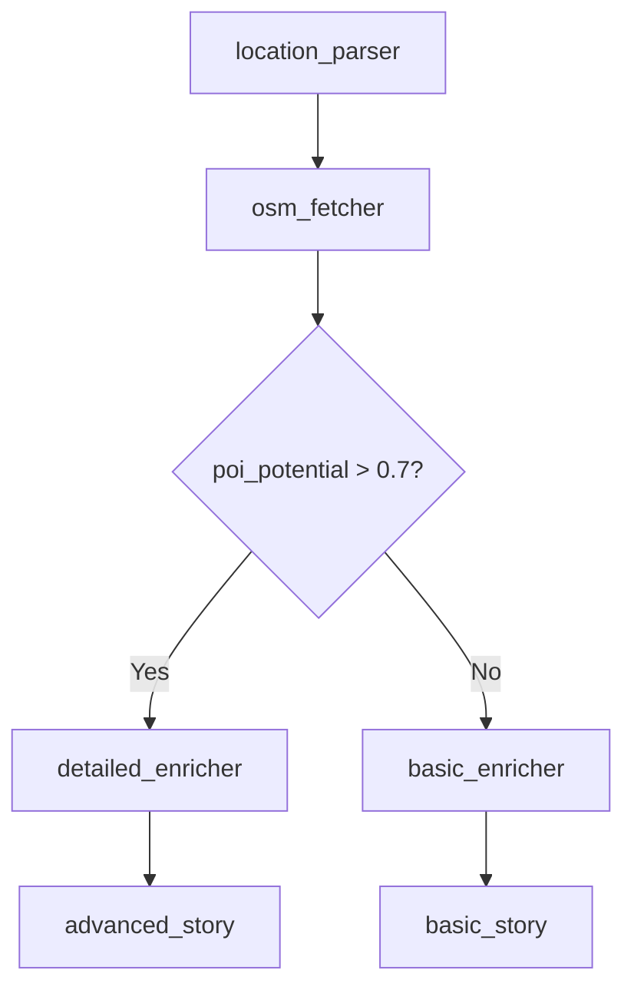

# Graph-Based Pipeline Architecture 2.0

## Overview

This system implements graph-based pipeline execution with conditional routing and service injection.

## Core Architecture Principles

### 1. **Graph-First Design**
- All pipelines are defined as **directed acyclic graphs (DAGs)**
- Conditional branching based on step outputs

### 2. **Intelligent Flow Control**
- **Expression-based routing**: Simple logical conditions
- **AI-driven routing**: Agent-based decision making (future)
- **Function-based routing**: Custom business logic (future)

### 3. **Service Injection & Dependency Management**
- Preserved from Architecture 1.0
- Clean `ServiceRegistry` pattern
- Database and HTTP service access via `self.get_db()`, `self.get_http()`

## Technical Architecture

### Core Components

```
ia_modules/pipeline/
├── core.py              # Enhanced Pipeline, Step, HumanInputStep
├── services.py          # ServiceRegistry (unchanged)
├── runner.py            # Graph-aware JSON pipeline loader
├── examples/            # Graph-based pipeline examples
│   ├── conditional_pipeline.json
│   ├── demo_steps.py
│   └── run_example.py
└── GRAPH_PIPELINE_ARCHITECTURE.md
```

### Enhanced Pipeline Class

```python
class Pipeline:
    """Graph-based pipeline orchestrator"""

    def __init__(self, steps: List[Step], structure: Dict[str, Any], services: ServiceRegistry):
        self.steps = steps
        self.structure = structure  # Required: graph definition
        self.services = services

    async def run(self, data: Dict[str, Any]) -> Dict[str, Any]:
        """Execute pipeline as directed graph"""
        if not self.has_flow_definition():
            raise ValueError("Pipeline requires flow definition")
        return await self._execute_graph(data)
```

### Step Execution Model

**Step implementations remain unchanged** - preserving the clean interface:

```python
class MyStep(Step):
    async def work(self, data: Dict[str, Any]) -> Any:
        # Access services
        db = self.get_db()
        http = self.get_http()

        # Business logic
        return {"result": processed_data}
```

## Graph Pipeline Definition Format

### Enhanced JSON Schema

```json
{
  "name": "Advanced Travel Pipeline",
  "description": "Graph-based pipeline with conditional flows",
  "version": "2.0",
  "steps": [
    {
      "id": "step_id",                    // Required: unique step identifier
      "name": "Human Readable Name",      // Required: display name
      "type": "task",                     // Required: task|human_input
      "step_class": "StepClassName",      // Required: Python class name
      "module": "module.path",            // Required: import path
      "config": {...},                    // Optional: step configuration
      "input_schema": {...},              // Optional: JSON schema validation
      "output_schema": {...}              // Optional: output contract
    }
  ],
  "flow": {
    "start_at": "first_step_id",          // Required: entry point
    "paths": [
      {
        "from": "step_a",                 // Required: source step
        "to": "step_b",                   // Required: target step
        "condition": {                    // Required: routing condition
          "type": "expression",           // expression|always|agent|function
          "config": {
            "source": "result.score",     // Data path to evaluate
            "operator": "greater_than",   // Comparison operator
            "value": 0.7                  // Threshold value
          }
        }
      }
    ]
  }
}
```

### Supported Condition Types

#### 1. Always Condition
```json
{"type": "always"}
```
- Always takes this path (fallback/default)

#### 2. Expression Condition
```json
TODO: Create a doocument of all possible expressions IA Pipelines can/should perform.
{
  "type": "expression",
  "config": {
    "source": "result.quality_score",
    "operator": "greater_than_or_equal",
    "value": 75
  }
}
```

**Supported Operators:**
- `equals`, `greater_than`, `greater_than_or_equal`
- `less_than`, `equals_ignore_case`

#### 3. Future: Agent Condition (AI-Driven Routing)
```json
{
  "type": "agent",
  "config": {
    "agent_id": "quality_assessor_agent",
    "input": {"prompt": "Assess content quality: {result}"},
    "output": {"evaluation": {"operator": "equals", "value": "high_quality"}}
  }
}
```

#### 4. Future: Function Condition (Custom Business Logic)
```json
{
  "type": "function",
  "config": {
    "function_class": "BusinessRulesValidator",
    "function_method": "validate_lead_quality",
    "expected_result": true
  }
}
```

## Human-in-the-Loop (HITL) Architecture

### HITL Step Definition

```json
{
  "id": "human_approval",
  "name": "Human Review",
  "type": "human_input",
  "step_class": "HumanInputStep",
  "config": {
    "ui_schema": {
      "title": "Review Content",
      "fields": [
        {"name": "decision", "type": "radio", "options": ["Approve", "Reject"]},
        {"name": "notes", "type": "textarea"}
      ]
    }
  }
}
```

### HITL Base Implementation

```python
class HumanInputStep(Step):
    """Base class for human-in-the-loop steps"""

    async def work(self, data: Dict[str, Any]) -> Any:
        ui_schema = self.config.get('ui_schema', {})

        # Base implementation - override with specific HITL integration
        return {
            'human_input_required': True,
            'ui_schema': ui_schema,
            'message': f'Human input step {self.name}'
        }
```

## Real-World Examples

### Example 1: Travel Content Pipeline

**Intelligent Flow Logic:**
1. **High-confidence location** → Detailed POI enrichment → Advanced story
2. **Low-confidence location** → Basic POI enrichment → Simple summary

```json
{
  "flow": {
    "start_at": "location_parser",
    "paths": [
      {
        "from": "osm_fetcher",
        "to": "poi_enricher_detailed",
        "condition": {
          "type": "expression",
          "config": {"source": "result.poi_potential", "operator": "greater_than", "value": 0.7}
        }
      },
      {
        "from": "osm_fetcher",
        "to": "poi_enricher_basic",
        "condition": {"type": "always"}
      }
    ]
  }
}
```

### Example 2: Lead Processing Pipeline

**Quality-Based Routing:**
1. **High-quality leads** → Human review → CRM integration
2. **Low-quality leads** → Automated notification only

```json
{
  "flow": {
    "paths": [
      {
        "from": "lead_scorer",
        "to": "human_review",
        "condition": {
          "type": "expression",
          "config": {"source": "result.score", "operator": "greater_than_or_equal", "value": 75}
        }
      },
      {
        "from": "lead_scorer",
        "to": "automated_notification",
        "condition": {"type": "always"}
      }
    ]
  }
}
```

## Migration from Architecture 1.0

### Breaking Changes
- **No backward compatibility** for sequential pipelines
- All pipelines **must define flow** structure
- Step definitions require `id` and `type` fields


### Step Implementation Compatibility

**✅ No changes required** for existing step implementations:
- `async def work(self, data)` interface unchanged
- Service access (`self.get_db()`) unchanged
- Configuration access (`self.config`) unchanged

## Development Workflow

### 1. Design Pipeline Graph


### 2. Define JSON Configuration
- Map graph nodes to step definitions
- Define conditional flow paths
- Add input/output schemas

### 3. Implement Step Classes
- Focus on business logic only
- Use service injection for dependencies
- Return structured data for conditions

### 4. Test & Validate
- Unit test individual steps
- Integration test flow paths
- Validate condition logic

## Future Enhancements

### Phase 2: Template Parameter System
```json
{
  "parameters": {
    "query": "{pipeline_input.business_type} in {steps.geocoder.result.city}"
  }
}
```

### Phase 3: Advanced Routing
- **Agent-based conditions** for AI-driven routing
- **Function-based conditions** for complex business rules
- **Parallel execution** for independent paths

### Phase 4: Visual Pipeline Editor
- **Drag-and-drop** graph construction
- **Real-time validation** of flow logic
- **Collaborative editing** for teams

## Conclusion

This architecture provides graph-based pipeline execution with conditional routing, service injection, and human-in-the-loop capabilities.


● Based on my analysis of the pipeline step implementations, here's the comprehensive report:

  Pipeline Step Implementation Analysis

  ✅ EXISTING AND WORKING STEPS:

  Core Pipeline Steps:
  - LocationParserStep - ✅ Exists and works with current system
  - OSMFetcherStep - ✅ Exists and works with current system
  - POIEnricherStep - ✅ Exists and works with current system
  - GeminiTravelStoryWriterStep - ✅ Exists and works with current system

  Knowledge Pipeline Steps:
  - SourceDiscoveryStep - ✅ Exists in knowledge/ subdirectory
  - Additional knowledge steps are implemented in the knowledge/ subdirectory

  ⚠️ COMPATIBILITY ISSUES WITH NEW GRAPH-BASED SYSTEM:

  The existing steps have compatibility issues with the new graph-based pipeline system:

  1. Output Schema Mismatch: The converted JSON pipelines expect specific output fields that the      
  current Python classes don't return. For example:

  1. Expected in JSON configs:
  "output_schema": {
    "location_confidence": {"type": "number"},
    "poi_potential": {"type": "number"},
    "content_depth": {"type": "number"}
  }

  1. Actual Python step output:
  return {
    "parsed_location": parsed_location,
    "search_radius": default_radius,
    "success": True
  }
  2. Missing Quality Metrics: The graph-based system relies on quality metrics for routing
  decisions, but current steps don't calculate them:
    - location_confidence, validation_score
    - data_richness, poi_potential, enrichment_quality
    - content_depth, cultural_significance
  3. Input Data Structure: Current steps expect specific input structure (data.get('poi_enricher',    
   {})) but graph-based system passes different structure.

  🚫 MISSING STEP CLASSES:

  These step classes referenced in the converted pipelines don't exist yet:

  - NominatimGeocoderStep
  - DBpediaEnrichmentStep (referenced but may be different from existing)
  - OSMPOISearchStep
  - RIDBEnricherStep
  - WikipediaScraperStep
  - PlaceConsolidatorStep
  - AITravelStoryGeneratorStep
  - DatabaseStorageStep
  - GeoWikipediaScraperStep

  📋 REQUIRED UPDATES:

  To make the existing steps work with the new graph-based system, they need:

  1. Output Schema Updates: Add the quality metrics expected by the JSON configs
  2. Input Handling: Update to handle the new data flow structure
  3. Quality Calculations: Implement the scoring algorithms used for routing decisions
  4. Missing Steps: Create the missing step classes
  5. Module Structure: Some steps may need to be moved or have module paths updated

  The steps exist and work, but they need to be updated to match the output schemas and quality       
  metrics defined in the converted pipeline JSON files.