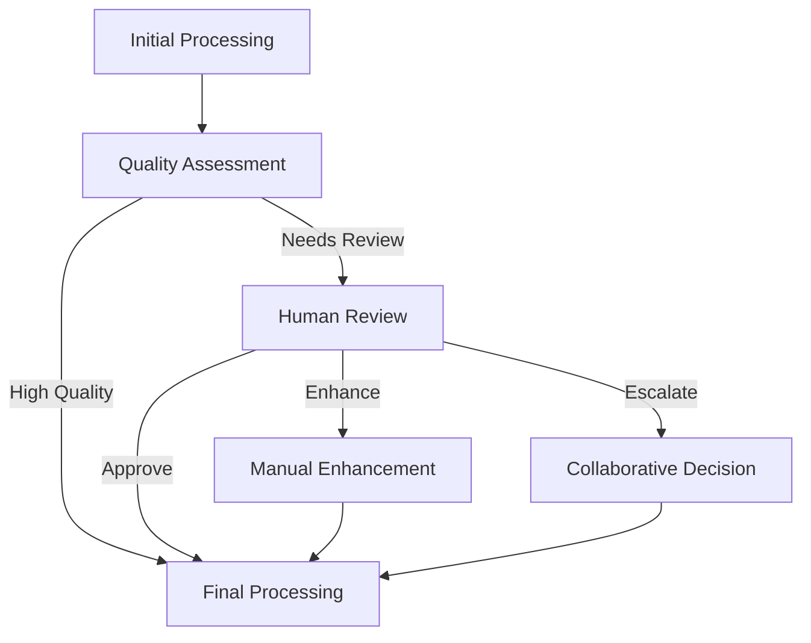

# Human-in-the-Loop (HITL) Test Pipeline

## Overview

This test pipeline demonstrates comprehensive Human-in-the-Loop functionality within the IA Modules framework. It showcases various HITL interaction patterns and provides a complete testing environment for human-AI collaboration scenarios.

## HITL Patterns Demonstrated

### 1. 🔄 **Pause-and-Resume Pattern** (`HumanReviewStep`)
- Pipeline pauses execution for human input
- Configurable timeout settings
- Rich UI schema for structured input
- Simulated human decision making for testing

### 2. 🎨 **Iterative Refinement Pattern** (`ManualEnhancementStep`)  
- Progressive enhancement through multiple iterations
- History tracking of all enhancement rounds
- Continue/stop decision points
- Quality improvement validation

### 3. 👥 **Multi-Stakeholder Collaboration** (`CollaborativeDecisionStep`)
- Multiple reviewers voting on decisions
- Different voting strategies (all, majority, any)
- Consensus tracking and result compilation
- Real-time collaboration simulation

### 4. 🤖 **Auto-with-Human-Fallback** (`QualityAssessmentStep`)
- Automated processing with quality thresholds
- Escalation triggers for human intervention
- Confidence-based routing decisions
- Smart triage logic

### 5. 📋 **Exception Handling Pattern** (Throughout Pipeline)
- Graceful handling of low-quality content
- Error escalation to human reviewers
- Recovery strategies and fallback paths
- Comprehensive audit trails

## Pipeline Flow



## Step Details

### Initial Processing Step
- **Purpose**: Simulates automated content processing
- **Output**: Processed content with quality metrics
- **Quality Simulation**: Random quality scores to trigger different paths
- **Issues Detection**: Identifies potential problems requiring human attention

### Quality Assessment Step  
- **Purpose**: Determines if human intervention is required
- **Logic**: Evaluates quality score, confidence, and detected issues
- **Thresholds**: Configurable quality and confidence thresholds
- **Routing**: Directs flow to appropriate next step based on assessment

### Human Review Step (HITL Pattern #1)
- **Purpose**: Pauses pipeline for human review and decision
- **UI Schema**: Rich form with multiple decision options
- **Timeout**: Configurable timeout for human response
- **Simulation**: Automated responses based on content quality for testing

### Manual Enhancement Step (HITL Pattern #2)
- **Purpose**: Iterative content improvement by humans
- **Iterations**: Supports multiple enhancement rounds
- **History**: Tracks all enhancement attempts and changes
- **Continuation**: Allows proceeding to next iteration or completion

### Collaborative Decision Step (HITL Pattern #3)
- **Purpose**: Multi-stakeholder voting and consensus building
- **Stakeholders**: Configurable list of decision makers
- **Voting Types**: All, majority, or any approval strategies
- **Results**: Compiled voting results with consensus metrics

### Final Processing Step
- **Purpose**: Compiles final output with complete audit trail
- **Audit Trail**: Detailed log of all pipeline steps and human interactions
- **Summary**: HITL interaction statistics and outcomes
- **Output**: Structured final result with metadata

## Testing Features

### Simulated Human Responses
All HITL steps include simulated human responses for automated testing:
- **Quality-Based**: Responses vary based on content quality scores
- **Realistic**: Mimics real human decision patterns
- **Configurable**: Easy to modify simulation logic for different scenarios

### Comprehensive Audit Trail
Complete tracking of:
- All pipeline steps and their outcomes
- Human interaction timestamps and decisions
- Enhancement iterations and changes
- Collaborative decision voting results
- Processing metadata and quality metrics

### Flexible Configuration
Configurable parameters for:
- Quality and confidence thresholds
- Timeout settings for human responses
- Stakeholder lists for collaborative decisions
- Enhancement iteration limits
- UI schema customization

## Running the HITL Test Pipeline

### Basic Test
```bash
python tests/pipeline_runner.py tests/pipelines/hitl_pipeline/pipeline.json
```

### With Custom Content
```bash
python tests/pipeline_runner.py tests/pipelines/hitl_pipeline/pipeline.json --input '{
  "content": "This is test content that needs human review and potential enhancement."
}'
```

### Testing Different Quality Scenarios

#### High Quality (Auto-Approval Path)
```bash
# Simulates content that passes automated quality checks
python tests/pipeline_runner.py tests/pipelines/hitl_pipeline/pipeline.json --input '{
  "content": "High quality content that meets all automated requirements and standards.",
  "simulated_quality": 0.9
}'
```

#### Medium Quality (Human Review Path)  
```bash
# Triggers human review step
python tests/pipeline_runner.py tests/pipelines/hitl_pipeline/pipeline.json --input '{
  "content": "Medium quality content that needs human review.",
  "simulated_quality": 0.75
}'
```

#### Low Quality (Enhancement Path)
```bash
# Triggers enhancement and collaborative decision paths
python tests/pipeline_runner.py tests/pipelines/hitl_pipeline/pipeline.json --input '{
  "content": "Low quality content requiring improvement.",
  "simulated_quality": 0.6
}'
```

## Expected Output Structure

```json
{
  "status": "complete",
  "processing_summary": {
    "processing_id": "uuid",
    "original_content": "...",
    "final_content": "...",
    "quality_metrics": {...}
  },
  "hitl_summary": {
    "human_review_occurred": true,
    "enhancement_occurred": true,
    "collaborative_decision_occurred": false,
    "total_human_interactions": 3,
    "review_decision": "request_enhancement"
  },
  "audit_trail": [
    {
      "step": "initial_processing",
      "timestamp": "2025-09-25T10:00:00Z",
      "action": "automated_processing",
      "result": "content_processed"
    }
    // ... more audit entries
  ],
  "complete_data_trace": {
    // Full pipeline data for debugging
  }
}
```

## Key Testing Scenarios

### 1. Automated Approval Flow
- High quality content (score > 0.85)
- Bypasses human review
- Direct to final processing

### 2. Human Review and Approval  
- Medium quality content (0.75-0.85)
- Human review step activated
- Approval leads to final processing

### 3. Enhancement Workflow
- Low-medium quality (0.65-0.75)  
- Human review requests enhancement
- Iterative improvement process
- Final processing after enhancement

### 4. Escalation and Collaboration
- Very low quality (< 0.65)
- Escalated to team decision
- Multi-stakeholder voting
- Consensus-based final decision

### 5. Error Recovery
- Processing failures or edge cases
- Graceful degradation to human oversight
- Error documentation in audit trail

## Integration Points

This test pipeline integrates with:
- **Database Services**: For state persistence during pauses
- **WebSocket Services**: For real-time collaboration notifications  
- **Authentication Services**: For user identification in multi-user scenarios
- **Logging Services**: For comprehensive audit trail creation
- **Cache Services**: For temporary state storage during HITL interactions

## Customization

### Adding New HITL Patterns
1. Create new step class inheriting from `Step`
2. Implement HITL interaction logic in `work()` method
3. Define UI schema for human interaction
4. Add to pipeline configuration
5. Update flow paths accordingly

### Modifying Decision Logic
Update the quality assessment thresholds and routing logic in:
- `QualityAssessmentStep` - Main triage logic
- `HumanReviewStep` - Review decision handling
- Pipeline flow configuration - Routing conditions

### Custom UI Schemas
Modify the UI schemas in step configurations to customize:
- Form fields and validation
- User interface layout
- Decision options and labels
- Help text and instructions

This HITL test pipeline provides a comprehensive testing environment for human-AI collaboration patterns and serves as a reference implementation for building production HITL systems.